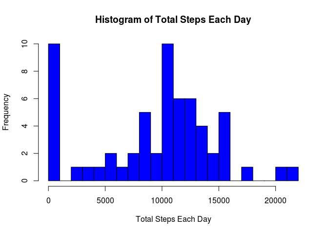
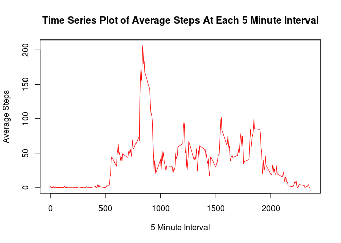
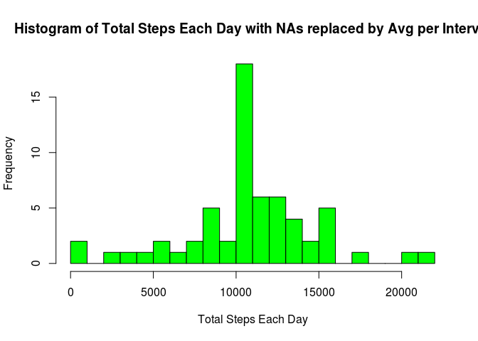
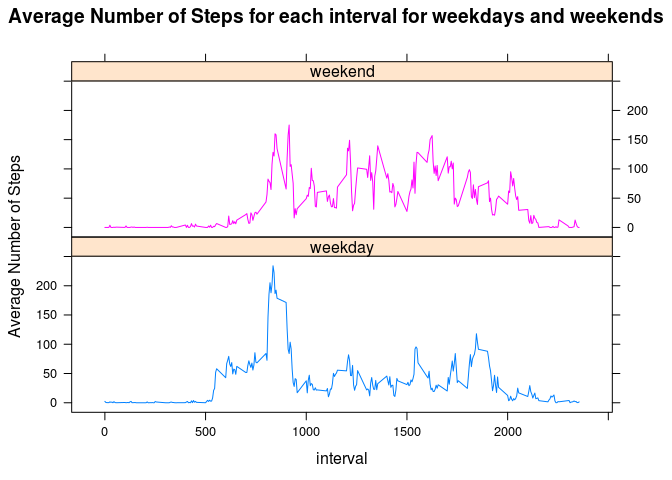

# Reproducible Research: Peer Assessment 1

#


## Loading and preprocessing the data


```r
#Download the file for Assignment from Coursera Website
download.file("https://d396qusza40orc.cloudfront.net/repdata%2Fdata%2Factivity.zip","repdataactivity.zip")

#Unzip the archieve
unzip("repdataactivity.zip")

#Load the CSV data in R
data <- read.csv("activity.csv",na.strings = "NA")

#Transform for further processing
data <- transform(data,date=as.Date(date),steps=as.numeric(steps))

#Load the dplyr package for manipulating data
library(dplyr)

#Convert the data frame to data.table
data <- tbl_df(data)
```

## What is mean total number of steps taken per day?


```r
#Sum the steps for each date
stepsperday <- data %>%
        group_by(date) %>%
        summarise(totalsteps=sum(steps,na.rm=T))

#Plot the histogram
hist(stepsperday$totalsteps,col="blue",xlab="Total Steps Each Day",main="Histogram of Total Steps Each Day",breaks=20)
```

\

```r
#Calculate and show mean for total steps each day
stepsperday.mean <- mean(stepsperday$totalsteps,na.rm = T)
print(stepsperday.mean)
```

```
## [1] 9354.23
```

```r
#Calculate and show median for total steps each day
stepsperday.median <- median(stepsperday$totalsteps,na.rm = T)
print(stepsperday.median)
```

```
## [1] 10395
```

## What is the average daily activity pattern?


```r
#Calculate the average for all intervals
avgstepsperinterval <- data %>%
        group_by(interval) %>%
        summarise(averagesteps=mean(steps,na.rm=T))

#Plot the timeseries for Interval wise mean
plot(avgstepsperinterval$averagesteps ~ avgstepsperinterval$interval,type="l",col="red",main="Time Series Plot of Average Steps At Each 5 Minute Interval",xlab="5 Minute Interval",ylab="Average Steps")
```

\

```r
#Get the 5-minute interval having maximum average steps
maxinterval <- max(avgstepsperinterval$averagesteps)
names(maxinterval) <- as.character(avgstepsperinterval[avgstepsperinterval$averagesteps==maxinterval,"interval"])

#Print the maxinterval
print(paste("Maxium average of steps is ",maxinterval," for interval ",names(maxinterval)))
```

```
## [1] "Maxium average of steps is  206.169811320755  for interval  835"
```

The maximum average of steps is **206.1698113** for interval **835** 

## Imputing missing values


```r
#Check total NA values
NAcount <- sum(!complete.cases(data))
print(paste("Count of rows having NA: ",NAcount))
```

```
## [1] "Count of rows having NA:  2304"
```

```r
#We will be using the Average Number of Steps generated per interval in second question of the assignment to replace NA values
#We will be using left_join operation for this

#Join main data and avgperinterval on interval
joineddata <- left_join(data,avgstepsperinterval,by="interval")

#Create a new data set by replacing NA with average steps per intervals
newdata <- joineddata %>%
        mutate(steps=ifelse(is.na(steps),averagesteps,steps)) %>%
        select(steps,date,interval)

#Sum the steps for each date with new data
stepsperday.new <- newdata %>%
        group_by(date) %>%
        summarise(totalsteps=sum(steps,na.rm=T))

#Plot the histogram for new data
hist(stepsperday.new$totalsteps,col="green",xlab="Total Steps Each Day",main="Histogram of Total Steps Each Day with NAs replaced by Avg per Interval",breaks=20)
```

\

```r
#Calculate and show mean for total steps each day for new data
stepsperday.mean.new <- mean(stepsperday$totalsteps,na.rm = T)
print(stepsperday.mean.new)
```

```
## [1] 9354.23
```

```r
#Calculate and show median for total steps each day for new data
stepsperday.median.new <- median(stepsperday.new$totalsteps,na.rm = T)
print(stepsperday.median.new)
```

```
## [1] 10766.19
```

```r
#Communicate Impact on Daily Steps, mean and median
impact.totalsteps <- (sum(newdata$steps,na.rm = T) - sum(data$steps,na.rm = T))

print(paste("Total addtional steps added: ",impact.totalsteps))
```

```
## [1] "Total addtional steps added:  86129.5094339623"
```

```r
impact.totalsteps.perc <- (sum(newdata$steps,na.rm = T) - sum(data$steps,na.rm = T))/sum(data$steps,na.rm = T)

print(paste("Perc. change in total steps : ",impact.totalsteps.perc))
```

```
## [1] "Perc. change in total steps :  0.150943396226415"
```

```r
impact.mean <- stepsperday.mean.new - stepsperday.mean 

print(paste("Difference in mean: ",impact.mean))
```

```
## [1] "Difference in mean:  0"
```

```r
impact.median <- stepsperday.median.new - stepsperday.median

print(paste("Difference in median: ",impact.median))
```

```
## [1] "Difference in median:  371.188679245282"
```

## Are there differences in activity patterns between weekdays and weekends?


```r
#Creating a new dataset with addition of daytype column flagging weekday and weekend
avgperintervalbydaytype <- data %>%
        mutate(daytype=as.factor(ifelse(weekdays(date)=="Saturday" | weekdays(date)=="Sunday","weekend","weekday"))) %>%
        group_by(daytype,interval) %>%
        summarise(averagesteps=mean(steps,na.rm=T))

#Load lattic package for panel plot
library(lattice)

#Plot the timeseries for weekday and weekends
xyplot(averagesteps ~ interval | daytype,data=avgperintervalbydaytype,type="l",groups = daytype,layout=c(1,2),ylab = "Average Number of Steps",main="Average Number of Steps for each interval for weekdays and weekends")
```

\
